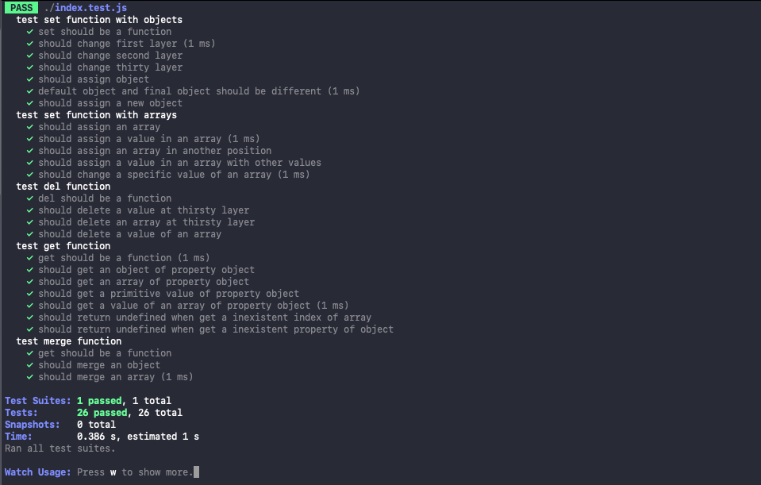

# Object Path - TDD implementation

## An immutable implementation of dot-prop



## Get, set, or delete a property from a nested object using a dot path

get(object, path, defaultValue?)
Get the value of the property at the given path.

Returns a value if any.

```javascript
const obj = {
  property: {
    test: "A",
  },
};

const result = get(obj, "property");
```

## Set the property at the given path to the given value.

set(object, path, value)

Returns a object.

```javascript
const obj = {
  property: {
    test: "A",
  },
};

const result = set(obj, "property", "B");
```

## Delete the property at the given path.

delete(object, path)

Returns a object without the property deleted.

```javascript
const obj = {
  property: {
    test: "A",
  },
};

const result = del(obj, "property.test");
```

## Merge the property that has an array or an object.

merge(object, path)

Returns a object with the property and value passed by argument merged.

```javascript
const obj = {
  property: {
    test: [1, 2],
  },
};

const result = merge(obj, "property.test", [3, 4]);
```

## Run Tests

```bash
yarn test
```
